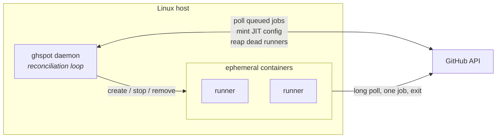

# gh-spot-docker-runners

Self-hosted GitHub Actions runners as ephemeral Docker containers, with full lifecycle management
from a single Python daemon.

GitHub's free plan caps Actions minutes on private repositories. Self-hosted runners don't consume
those minutes. This project turns one Linux host into an on-demand runner fleet: it watches your
repositories for queued jobs, starts a fresh container per job, and tears it down — on both sides —
when the job finishes.

> **Status:** alpha, under active development. Not yet published to PyPI.

## What makes it different

- **No credentials in the container.** Runners are registered through GitHub's
  [just-in-time config API][jit]. The container receives a single-use, pre-scoped config blob —
  never your personal access token. A compromised job cannot register more runners.
- **Continuous reconciliation.** A control loop observes Docker and GitHub, diffs them against your
  declared configuration, and converges both ways. Runners stuck `Offline` after a hard kill, or
  containers orphaned by a daemon crash, are repaired on the next tick rather than by a cleanup
  script you remember to run.
- **Demand-driven.** The daemon polls for queued jobs and scales the pool to match, within the
  bounds you set. No inbound ports, so it works behind NAT on a home server.
- **Genuinely testable.** Domain logic is pure Python with no I/O; Docker and GitHub sit behind
  ports, so the scaling policy and the reconciliation loop are unit-tested without either.

[jit]: https://docs.github.com/en/rest/actions/self-hosted-runners#create-configuration-for-a-just-in-time-runner-for-a-repository

## Architecture

Layered as ports and adapters:

| Layer | Contains | Depends on |
|---|---|---|
| `domain` | Aggregates, value objects, the scaling policy, port protocols | nothing |
| `application` | Use cases, the reconciliation service | `domain` |
| `infrastructure` | GitHub client, Docker backend, SQLite, config, logging | `domain` |
| `interfaces` | Typer CLI, FastAPI routers | `application` |

The dependency rule is enforced by a test, not by convention.

## Requirements

- Linux host with Docker
- Python 3.12+
- A fine-grained GitHub personal access token scoped to the target repositories, with
  **Administration: read & write** and **Actions: read**

## Documentation

- [`docs/architecture.md`](docs/architecture.md) — how the pieces fit together
- [`docs/operations.md`](docs/operations.md) — install, configure, run, troubleshoot
- [`docs/adr/`](docs/adr/) — the decisions and why they were made
- [`CONTEXT.md`](CONTEXT.md) — project history

## License

Apache-2.0. See [LICENSE](LICENSE).
