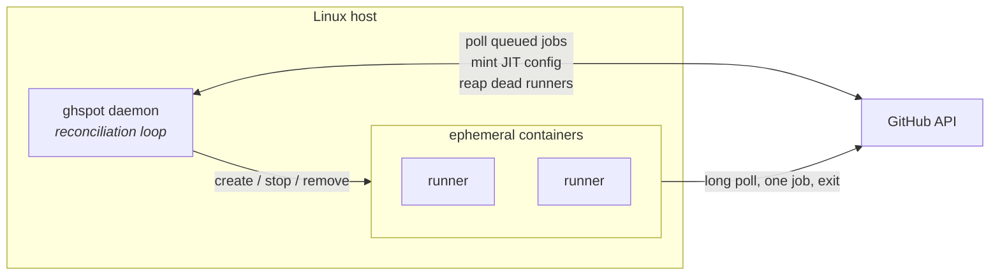

# gh-spot-docker-runners

Self-hosted GitHub Actions runners as ephemeral Docker containers, managed by a single
Python daemon.

GitHub's free plan caps Actions minutes on private repositories. Self-hosted runners don't consume
those minutes. This project turns one Linux host into an on-demand runner fleet: it watches your
repositories for queued jobs, starts a fresh container per job, and tears it down, on both
sides, when the job finishes.

> **Status:** alpha, under active development. Not yet published to PyPI.

## What makes it different

- **No credentials in the container.** Runners are registered through GitHub's
  [just-in-time config API][jit]. The container receives a single-use, pre-scoped config blob —
  never your token or your app's key. A compromised job cannot register more runners.
- **Continuous reconciliation.** A control loop observes Docker and GitHub, diffs them against your
  declared configuration, and converges both ways. Runners stuck `Offline` after a hard kill, and
  containers orphaned by a daemon crash, are repaired on the next tick. There is no cleanup
  script to run.
- **`pm`, as php-fpm means it.** A pool declares whether it keeps runners `static`, `dynamic`
  or `ondemand`, and a setting that does not apply to its mode is refused rather than
  silently ignored.
- **Demand-driven.** The daemon polls for queued jobs and scales the pool to match, within the
  bounds you set. No inbound ports, so it works behind NAT on a home server.
- **No I/O in the domain.** Docker and GitHub sit behind ports, so the scaling policy and the
  reconciliation loop are unit-tested without a daemon or a network.
- **GPUs, if the host has them.** A pool can hand its jobs every card, a count, or specific
  ones — and `requires_labels` keeps plain CPU work off them.

[jit]: https://docs.github.com/en/rest/actions/self-hosted-runners#create-configuration-for-a-just-in-time-runner-for-a-repository

## Architecture



Layered as ports and adapters:

| Layer | Contains | Depends on |
|---|---|---|
| `domain` | Aggregates, value objects, the scaling policy, port protocols | nothing |
| `application` | Use cases, the reconciliation service | `domain` |
| `infrastructure` | GitHub client, Docker backend, SQLite, config, logging | `domain` |
| `interfaces` | Typer CLI, FastAPI routers | `application` |

The dependency rule is enforced by a test, not by convention.

## Quick start

On Debian or Ubuntu, take the `.deb` from the
[latest release](https://github.com/tguisep/gh-spot-docker-runners/releases/latest). It
bundles its own Python, so it needs nothing from the system interpreter:

```bash
sudo apt install ./ghspot_*.deb
```

<details><summary>Or install from source</summary>

```bash
git clone https://github.com/tguisep/gh-spot-docker-runners.git
cd gh-spot-docker-runners
uv tool install .          # then `uv tool update-shell` if ghspot isn't found
```

</details>

```bash
# Build the runner image with the host's docker group, so jobs can use the socket.
images/runner/build.sh ubuntu-24.04

cp config.example.toml config.toml && $EDITOR config.toml

export GHSPOT_GITHUB_TOKEN=github_pat_...          # or, for a GitHub App:
# export GHSPOT_GITHUB_APP_ID=123456
# export GHSPOT_GITHUB_APP_PRIVATE_KEY="$(cat app.pem)"

ghspot doctor      # checks the token, Docker, the image, and each repository
ghspot daemon
```

Then point a workflow at your labels:

```yaml
jobs:
  build:
    runs-on: [self-hosted, linux, x64, home-vm]
```

## GPUs

A pool can give its jobs the host's GPUs, provided the
[NVIDIA Container Toolkit](https://docs.docker.com/engine/containers/resource_constraints/#gpu)
is installed:

```toml
[[pool]]
name = "gpu"
labels = ["self-hosted", "linux", "x64", "gpu-a100"]

# Without this, a job asking only for [self-hosted, linux, x64] lands here and
# spends the GPU on unit tests — label matching is a subset rule.
requires_labels = ["gpu-a100"]

max_runners = 1                       # one runner per card

[pool.container]
image = "ghspot/runner:ubuntu-24.04"
gpus = "all"                          # or 1  —  or ["0", "1"]
```

```yaml
jobs:
  train:
    runs-on: [self-hosted, gpu-a100]
```

Name the hardware rather than the category — `gpu-a100`, not `gpu` — so a job needing 24 GB of
VRAM cannot land on a card with 8. `ghspot doctor` checks the toolkit whenever a pool asks for
GPUs, because without it every runner in that pool fails to start, and the error does not
mention the toolkit.

Full detail, including what `requires_labels` cannot prevent:
[`docs/operations.md`](docs/operations.md#gpus).

## Requirements

- Linux host with Docker, and a user in the `docker` group
- Python 3.12+
- Credentials with **Administration: read & write** (to register runners) and **Actions:
  read** (to see queued jobs) — either a fine-grained personal access token or a GitHub App.
  [`docs/authentication.md`](docs/authentication.md) sets up both, and explains why each
  permission is needed

## Commands

```
ghspot doctor                  check everything the daemon needs
ghspot daemon                  run the reconciliation loop
ghspot pool list               pools and what they hold
ghspot pool status <name>      one pool, with its runners
ghspot runner list [--all]     runners, from the local projection
ghspot runner logs <ref>       container output
ghspot runner stop <ref>       retire on both sides
ghspot stats [--since 7d]      runners, jobs, failures and time spent
ghspot config validate         load the config and report what it means, from every file
```

A REST API is served alongside the daemon when `api_bind` is set — see
[`docs/operations.md`](docs/operations.md).

## Security

Read [SECURITY.md](SECURITY.md) before pointing this at anything. The short version: with
`docker_socket = true` a job has **effective root on the host**, which is fine for
repositories you control and unacceptable for one that accepts fork pull requests.

## Documentation

- [`docs/authentication.md`](docs/authentication.md) — setting up a token or a GitHub App,
  and the exact permissions
- [`docs/architecture.md`](docs/architecture.md) — how the pieces fit together, and why
- [`docs/operations.md`](docs/operations.md) — install, configure, run, tune, troubleshoot
- [`docs/adr/`](docs/adr/) — the decisions, with the alternatives that were rejected
- [`SECURITY.md`](SECURITY.md) — threat model and hardening checklist
- [`CONTRIBUTING.md`](CONTRIBUTING.md) — layout rules and how to work on it
- [`CONTEXT.md`](CONTEXT.md) — project history

## License

Apache-2.0. See [LICENSE](LICENSE).
