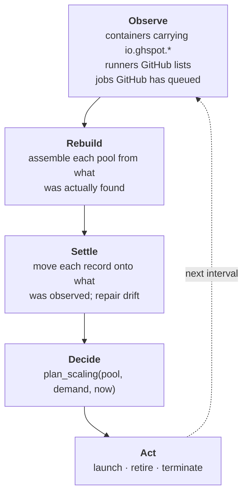
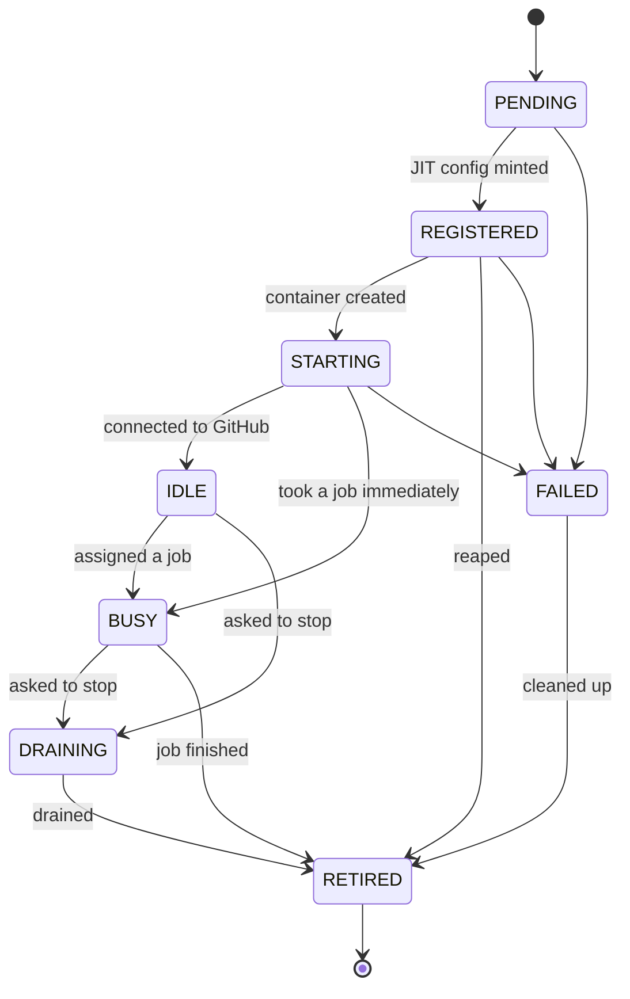

# Architecture

## The problem this shape solves

Running self-hosted runners means keeping two systems agreeing with each other — GitHub's
list of registered runners, and Docker's list of containers — with no transaction between
them and a process that can die at any point in between.

The usual shell-script approach handles the happy path and leaves the rest to a cleanup
script you remember to run. Every failure mode it has is a drift it cannot see:

| Reality | What a script-based setup does |
|---|---|
| Container killed with `SIGKILL` | GitHub keeps an `Offline` runner forever |
| Daemon dies after registering, before starting | Same, and nothing knows the registration exists |
| Container removed by hand | GitHub still lists a runner that will never answer |
| Job hangs past any sane duration | Nothing notices |

So the design starts from the drift rather than from the happy path.

## Two decisions everything else follows from

### 1. The credential never enters the container

Runners are registered through GitHub's just-in-time configuration API. The daemon calls
`POST /repos/{owner}/{repo}/actions/runners/generate-jitconfig` and receives an
`encoded_jit_config` blob scoped to exactly one runner. That blob — not a token — is what
goes into the container.

```
daemon ──generate-jitconfig──▶ GitHub
       ◀──{runner.id, encoded_jit_config}──
       │
       └──docker run -e RUNNER_JIT_CONFIG=<blob>──▶ container
```

Three consequences, and they shape the rest of the system:

- A compromised job cannot register more runners, or read anything about your account.
- Just-in-time runners are **inherently ephemeral** — one job, then the process exits and
  GitHub de-registers. There is no `config.sh remove`, no removal token, no cleanup step.
- **The GitHub runner id is known before the container exists.** Every container can be
  tied back to its registration, whatever order things happened in, which is what makes the
  drift table above recoverable.

### 2. Reality is observed, never remembered

One method, `ReconciliationService.tick()`, runs on an interval:



Nothing is carried between ticks. A tick that raises is logged and dropped, because the next
one re-derives everything from scratch. That is also why the SQLite database is a
*projection*: wipe it and the next tick adopts the running containers back from their own
labels. It costs history, never correctness — there is a test that asserts exactly this.

## Layers

```
interfaces      CLI (Typer) · REST API (FastAPI)
     │              driving adapters — entry points
     ▼
application     use cases · reconciliation loop · DTOs
     │              orchestration only, no decisions
     ▼
domain          aggregates · value objects · scaling policy · ports
                    pure Python; imports nothing concrete
     ▲
     │
infrastructure  GitHub client · Docker backend · SQLite · config · logging
                    driven adapters — implement the ports
```

The rule everything rests on: **`domain` and `application` depend on nothing concrete.**
`interfaces` may reach `infrastructure` because an entry point has to name a concrete
adapter or nothing would ever be constructed. `tests/unit/test_architecture.py` parses every
module and enforces this, so it cannot decay into a convention.

So the entire reconciliation loop, including crash recovery and every drift case, is tested
against in-memory fakes, with no Docker daemon and no network.

### The ports

| Port | Implemented by | Faked by |
|---|---|---|
| `ForgeClient` | `GitHubClient` (httpx) | `FakeForge` |
| `RunnerBackend` | `DockerRunnerBackend` | `FakeBackend` |
| `RunnerRepository` | `SqliteRunnerRepository` | `InMemoryRunnerRepository` |
| `Clock`, `IdGenerator` | `SystemClock`, `UuidGenerator` | `FakeClock`, `SequentialIds` |

`Clock` exists so a test can make a runner idle for an hour without waiting one.

## The runner lifecycle



The aggregate refuses illegal moves. That matters because every skipped step leaves an
orphan on one side or the other — a runner that goes straight from `PENDING` to `STARTING`
has a container with no registration behind it.

### The crash-critical window

`REGISTERED` — config minted, container not yet created — is the only state where GitHub
knows about a runner that does not exist. It is deliberately its own state, and the record
is persisted before the container is attempted, so a crash there leaves evidence.

Two crash shapes are handled differently, because they leave different evidence:

| Shape | Record after the crash | How it is reaped |
|---|---|---|
| Container failed to start | `FAILED` — compensation ran | No active record claims the registration, so the stray sweep deletes it on the next tick |
| `SIGKILL` mid-provision | `REGISTERED` — nothing ran | Indistinguishable from a slow boot, so a 5-minute grace period resolves it |

The second is exactly the runner that gets stuck `Offline` elsewhere.

## Scaling

`plan_scaling(pool, demand, now) -> ScalePlan` is a pure function. Its rules, in order:

1. Cover every queued job this pool can serve.
2. Keep `min_idle` runners warm **on top of** the queue.
3. Never exceed `max_runners`; never start more than `max_launch_per_tick` at once.
4. Reap runners idle beyond `idle_timeout`, never below `min_idle`.
5. Kill runners whose job overran `max_job_duration`.

Two anti-flapping rules are worth naming because they are not obvious:

- **Nothing is reaped while jobs are queued.** Reaping capacity in the same tick we are short
  of it would oscillate.
- **A plan never launches and reaps at once.** They are computed from one snapshot, so the
  plan cannot contradict itself.

Runners in `REGISTERED` and `STARTING` count as available capacity. Without that, a runner
booting for job A would be ignored and a second container started for the same job.

## Demand signal

The daemon polls rather than receiving webhooks, because a home server behind NAT cannot
expose an endpoint without a tunnel. Polling is affordable because of one detail:

> Every GET carries the `ETag` from the previous call, and a `304 Not Modified` **does not
> count against the rate limit.**

An idle repository is therefore nearly free to watch, even at a 15-second interval. Queued
jobs are gathered from `in_progress` runs as well as `queued` ones — a matrix leg is queued
after its run has already started, and would otherwise stay invisible.

Webhooks remain one adapter away: a `workflow_job` handler produces the same `QueuedJob`
value objects the poller does, and the policy would not change.

## Where the labels live

Correlation survives a daemon restart because it lives on the containers themselves:

| Label | Purpose |
|---|---|
| `io.ghspot.managed` | Finds this daemon's containers and nothing else |
| `io.ghspot.runner-id` | Ties a container to its record |
| `io.ghspot.github-runner-id` | Ties a container to its registration |
| `io.ghspot.pool` | Which pool it belongs to |
| `io.ghspot.created-at` | Rebuilding age after adoption |

## Further reading

- [`operations.md`](operations.md) — installing and running it
- [`adr/`](adr/) — the decisions, with the alternatives that were rejected
