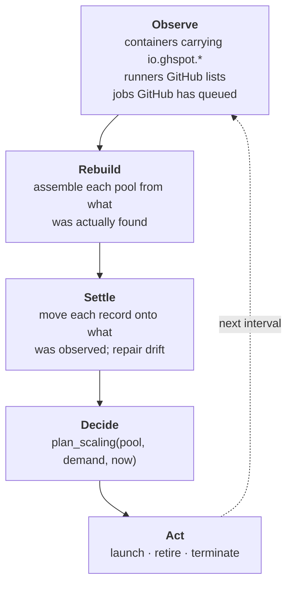

## The problem this shape solves

Running self-hosted runners means keeping two systems agreeing with each other — GitHub's
list of registered runners, and Docker's list of containers — with no transaction between
them and a process that can die at any point in between.

The usual shell-script approach handles the happy path and leaves the rest to a cleanup
script you remember to run. Every failure mode it has is a drift it cannot see:

| Reality | What a script-based setup does |
|---|---|
| Container killed with `SIGKILL` | GitHub keeps an `Offline` runner forever |
| Daemon dies after registering, before starting | Same, and nothing knows the registration exists |
| Container removed by hand | GitHub still lists a runner that will never answer |
| Job hangs past any sane duration | Nothing notices |

So the design starts from the drift rather than from the happy path.

## Two decisions everything else follows from

### 1. The credential never enters the container

Runners register through GitHub's just-in-time configuration API:
`POST /repos/{owner}/{repo}/actions/runners/generate-jitconfig` returns an `encoded_jit_config`
blob scoped to exactly one runner. **That blob, not a token, is what enters the container.**

```
daemon ──generate-jitconfig──▶ GitHub
       ◀──{runner.id, encoded_jit_config}──
       │
       └──docker run -e RUNNER_JIT_CONFIG=<blob>──▶ container
```

Three consequences, and they shape the rest of the system:

* A compromised job cannot register more runners, or read anything about your account.
* Just-in-time runners are **inherently ephemeral** — one job, then the process exits and
  GitHub de-registers. There is no `config.sh remove`, no removal token, no cleanup step.
* **The GitHub runner id is known before the container exists.** Every container can be
  tied back to its registration, whatever order things happened in, which is what makes the
  drift table above recoverable.

### 2. Reality is observed, never remembered

One method, `ReconciliationService.tick()`, runs on an interval:



Nothing is carried between ticks: one that raises is logged and dropped, because the next
re-derives everything from scratch.

That is why the SQLite database is a *projection*. Wipe it and the next tick adopts the running
containers back from their own labels — it costs history, never correctness, and a test asserts
exactly that.

## Further reading

* [Layers](layers/) — where each part is allowed to reach.
* [The runner lifecycle](lifecycle/) — the states, and the window a crash can land in.
* [Scaling](scaling/) — how many runners, and where the labels live.
* [State schema](schema/) — the tables, and why losing them costs history not correctness.
* [Decisions](../adr/) — each one with the alternatives that were rejected.
