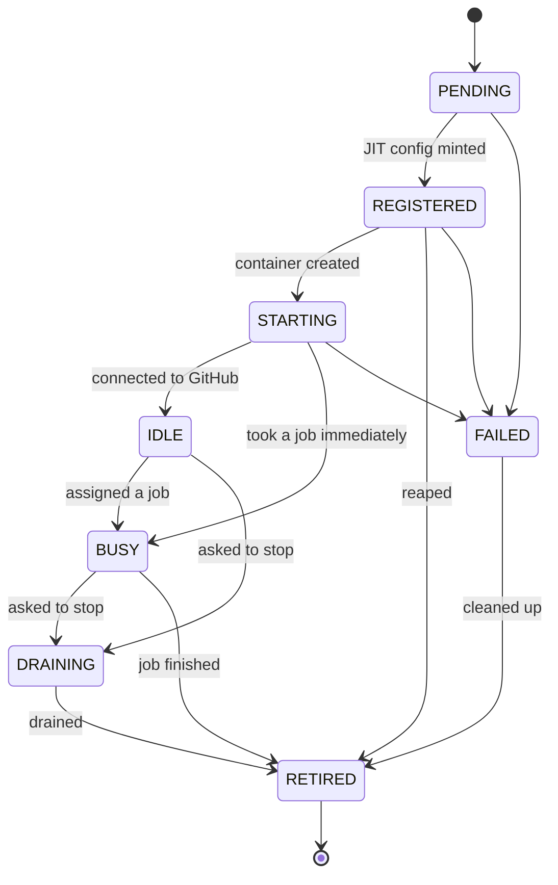

## The runner lifecycle

The aggregate refuses illegal moves. That matters because every skipped step leaves an
orphan on one side or the other — a runner that goes straight from `PENDING` to `STARTING`
has a container with no registration behind it.

### The crash-critical window

`REGISTERED` — config minted, container not yet created — is the only state where GitHub
knows about a runner that does not exist. It is deliberately its own state, and the record
is persisted before the container is attempted, so a crash there leaves evidence.

Two crash shapes are handled differently, because they leave different evidence:

| Shape | Record after the crash | How it is reaped |
|---|---|---|
| Container failed to start | `FAILED` — compensation ran | No active record claims the registration, so the stray sweep deletes it on the next tick |
| `SIGKILL` mid-provision | `REGISTERED` — nothing ran | Indistinguishable from a slow boot, so a 5-minute grace period resolves it |

The second is exactly the runner that gets stuck `Offline` elsewhere.
