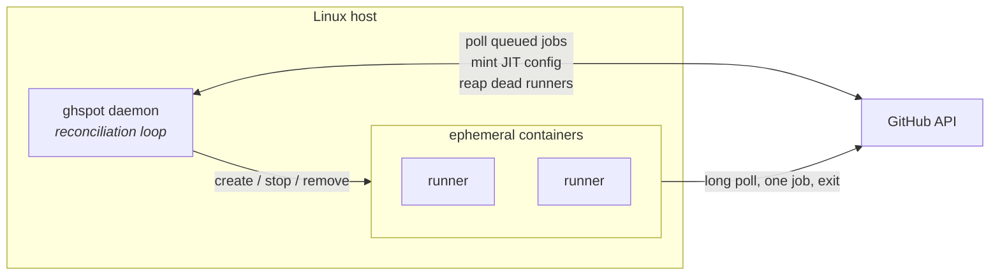

import { Card, CardGrid } from '@astrojs/starlight/components';

GitHub's free plan caps Actions minutes on private repositories. Self-hosted runners do not
consume them. This turns one Linux host into an on-demand fleet: it watches your repositories
for queued jobs, starts a fresh container per job, and tears it down on both sides when the job
finishes.

## What makes it different

<CardGrid>
    <Card title="No credentials in the container" icon="approve-check">
        Runners register through GitHub's just-in-time config API. The container gets a
        single-use, pre-scoped blob — never your token or your app's key. A compromised job
        cannot register more runners.
    </Card>
    <Card title="Continuous reconciliation" icon="random">
        A loop observes Docker and GitHub, diffs them against your configuration, and converges
        both ways. Runners stuck `Offline` after a hard kill, and containers orphaned by a
        crash, are repaired on the next tick. No cleanup script.
    </Card>
    <Card title="Named keeping modes" icon="setting">
        A pool declares whether it keeps runners `static`, `dynamic` or `ondemand`, and a
        setting that does not apply to its mode is refused rather than silently ignored.
    </Card>
    <Card title="Demand-driven, no inbound ports" icon="rocket">
        The daemon polls for queued jobs and scales to match, within the bounds you set. It
        works behind NAT on a home server.
    </Card>
    <Card title="Bounded by the host, not just the pool" icon="warning">
        `max_runners` bounds one pool; ceilings on containers, CPU and memory bound the
        machine, and a load high-water mark defers launches while the box is struggling. Pools
        carry a `priority` — a share of contested capacity, not a rank.
    </Card>
    <Card title="GPUs, if the host has them" icon="star">
        A pool can hand its jobs every card, a count, or specific ones — and `requires_labels`
        keeps plain CPU work off them.
    </Card>
</CardGrid>

## What you need

- A Linux host with Docker, and a user in the `docker` group.
- Credentials with **Administration: read & write** (to register runners) and **Actions: read**
  (to see queued jobs) — a fine-grained personal access token or a GitHub App.
- Python 3.12+ only if installing from source. The `.deb` bundles its own.

[Authentication](start/authentication/) sets up both credential types and explains why each
permission is needed.

## The commands

| | |
|---|---|
| `ghspot setup` | Write a first configuration by answering a few questions |
| `ghspot doctor` | Check everything the daemon needs |
| `ghspot daemon` | Run the reconciliation loop |
| `ghspot image build <variant>` | Build a runner image on this host |
| `ghspot pool list` | Pools and what they hold |
| `ghspot pool status <name>` | One pool, with its runners |
| `ghspot runner list [--all]` | Runners, from the local projection |
| `ghspot runner logs <ref>` | Container output, or `--job` for GitHub's own |
| `ghspot runner stop <ref>` | Retire on both sides — `--all` empties the host |
| `ghspot stats [--since 7d]` | Runners, jobs, failures and time spent |
| `ghspot config validate` | Load the configuration and report what it means |

Every listing takes `--watch 2` to repaint in place, and `runner list` takes `--usage` for CPU
and memory per container.

A REST API is served alongside the daemon when `api_bind` is set, with a
[web dashboard](guides/operate/dashboard/) at `/ui` covering the same ground as the CLI.

## Layered as ports and adapters

| Layer | Contains | Depends on |
|---|---|---|
| `domain` | Aggregates, value objects, the scaling policy, port protocols | nothing |
| `application` | Use cases, the reconciliation service | `domain` |
| `infrastructure` | GitHub client, Docker backend, SQLite, config, logging | `domain` |
| `interfaces` | Typer CLI, FastAPI routers | `application` |

The dependency rule is enforced by a test, not by convention. See
[Architecture](reference/architecture/).

:::caution[Read this before pointing it at anything]
With `docker_socket = true` a job has **effective root on the host**. That is fine for
repositories you control and unacceptable for one that accepts fork pull requests — see
[SECURITY.md](https://github.com/tguisep/gh-spot-docker-runners/blob/main/SECURITY.md).
:::
